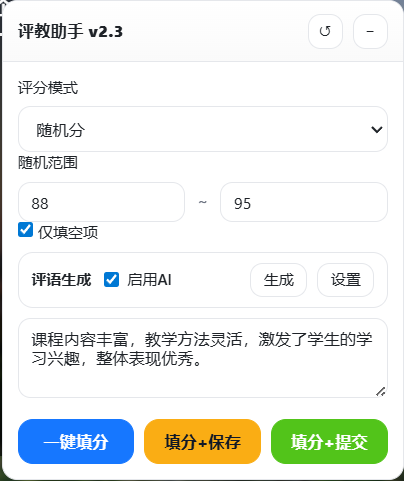
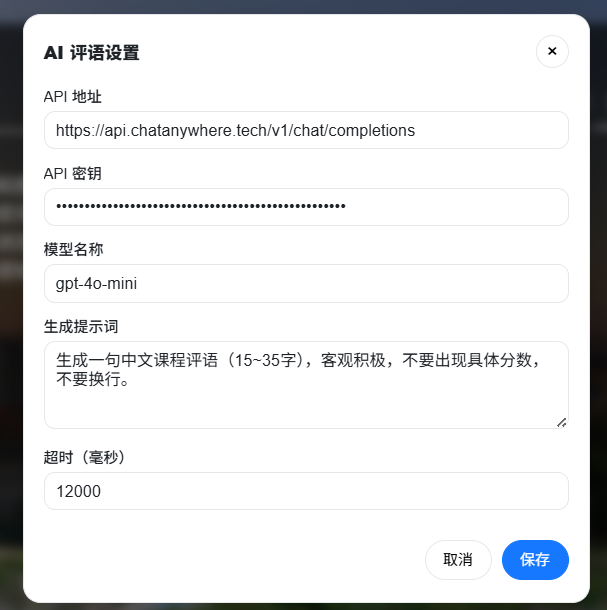

# 🎓 教务评教助手（可拖拽 + AI 评语 /v1/chat/completions）

> 一键填分 · 智能评语 · 可拖拽面板 · AI 接入可选

这个油猴脚本用于**教务评教页面**，帮助你快速完成各项评分，并可通过自定义或 AI 自动生成中文课程评语。脚本提供一个右下角悬浮控制面板，支持拖拽移动、折叠隐藏和配置持久化；AI 设置通过单独弹窗管理，避免面板被拉得过长。

***

## ✨ 功能一览

- 🧮 **智能填分**
  - 支持 4 种评分模式：每项满分 / 提示分 / 固定分 / 随机分。
  - 支持 “仅填空项”，不会覆盖你已经手动改过的项目。


- 💬 **评语自动填充**
  - 内置一个可编辑的中文评语模板。
  - 可选接入兼容 `/v1/chat/completions` 的 AI 接口，自动生成 15–35 字左右的客观、积极课程评语。


- ✅ **真实按钮弹出**
  - 填分后弹出系统原生的 “保存 / 提交” 按钮，由你手动点击，一眼就能看清当前行为，避免脚本直接帮你点掉。

- 🧷 **UI/交互优化**
  - 右下角悬浮面板，可拖拽、自动记住位置。
  - 一键折叠 / 展开控制面板，避免挡住页面内容。
  - AI 配置使用单独弹窗，内容多也不会撑高主面板。

***

## 🛠 安装步骤

### 1. 安装脚本管理器

根据浏览器选择一个脚本管理扩展：[3]

- Chrome / Edge：
  - 推荐安装 **Tampermonkey** 或 **Violentmonkey**。
- Firefox：
  - 可使用 **Tampermonkey** 或 **Greasemonkey**。
- 其他 Chromium 浏览器：
  - 原则上支持 Tampermonkey 的都可以使用。

### 2. 安装本脚本

有两种方式：

1. 在脚本平台（如 GreasyFork）点击 **“安装脚本”** 按钮。
2. 在脚本管理器中新建脚本，将源码完整复制进去保存。

> ⚠ 请确保 `@match` 规则中包含你学校的教务系统域名，脚本示例中已包含 `jwxt.gxnzd.com.cn` 及 VPN / 子域名匹配。

***

## 🌐 适配站点说明

当前脚本默认匹配以下地址：

- `https://jwxt.gxnzd.com.cn/*`
- `https://vpn.gxnzd.com.cn/*`
- `https://*.gxnzd.com.cn/*`

如果你所在学校的评教系统域名不同，可按如下方式修改：

```js
// ==UserScript==
// @match        https://你的教务域名/*
// ==/UserScript==
```

建议只匹配评教所在的系统域名，避免脚本在无关页面加载。

***

## 🧭 界面与操作说明

### 1. 控制面板入口

进入教务系统的**评教详情页**（能看到一堆评分输入框 + 评语文本域的页面）后，右下角会出现一个悬浮面板：“评教助手 v2.3”。

- ⬆ 拖拽：按住面板顶部区域（显示标题的那条）拖动，即可移动位置。
- 🔁 重置位置：点击右上角的 `↺`，面板会回到右下角默认位置。
- ➕ / ➖ 折叠/展开：
  - 点击 `−` 会折叠面板，只留下标题栏。
  - 折叠后按钮变为 `+`，再次点击可展开。
  - 展开/折叠状态会被记住，下次打开页面保持一致。

### 2. 评分模式区块

在控制面板顶部，有一块 “评分模式” 设置：

- 📌 模式选择：
  - **每项满分**：直接给每一项打允许范围内的最高分。
  - **提示分**：使用页面给出“提示分”（如果页面提供了 `data-tsfz`）。
  - **固定分**：统一使用你设定的分数（如 93），再和各项 min/max 做约束。
  - **随机分**：在你设置的随机区间内生成整数分数，落在每一项的 min/max 之内。

- 🎚 固定分数：
  - 当模式为 “固定分” 时，此输入框生效。
  - 可设置如 90/92/93 等常用评分。

- 🎲 随机范围：
  - 当模式为 “随机分” 时显示。
  - 左右两个输入框分别代表最小 / 最大分，例如 88 ~ 95。
  - 实际会对每一项再做 min/max 限制。

- ☑ 仅填空项：
  - 勾选后，脚本只会填补当前为空的输入框。
  - 对你已经手动调整过的分数不进行覆盖，更安全。

### 3. 评语与 AI 区域

#### 3.1 手动 / 模板评语

- 在 “评语生成” 下方有一个多行文本框：
  - 你可以直接输入想要的课程评语。
  - 脚本会将你最后一次的内容存到本地，下次自动加载。
- 不启用 AI 时：
  - 脚本在“需要评语”但页面为空时，会使用这里的内容填入。

#### 3.2 启用 AI 自动评语

- 勾选 ✅ “启用 AI” 后可以使用 AI 生成评论：
  - 🎛 点击 “设置”：打开 AI 配置弹窗。
  - ✨ 点击 “生成”：立刻调用 AI 接口，将生成结果放入面板中的评语文本框。

- AI 配置弹窗内容包括：
  - 📡 API 地址：例如 `https://api.example.com/v1/chat/completions`
  - 🔑 API 密钥：将会用 `Authorization: Bearer XXX` 方式传给服务端。
  - 🧠 模型名称：如 `gpt-4o-mini`、`gpt-3.5-turbo` 等，根据你的接口服务决定。
  - 🧾 生成提示词：
    - 用来约束 AI 生成的内容风格，如字数范围、不要出现具体分数、保持客观积极等。
  - ⏱ 超时（毫秒）：
    - 请求 AI 的最大等待时间，默认 12000（12 秒），可按网络情况调整。

- 弹窗交互特性：
  - 支持拖拽（拖动弹窗标题栏）。
  - 点击右上角 `×`、底部 “取消” 或遮罩空白区域都可以关闭。
  - 点击 “保存” 会将当前配置写入油猴存储，下次可直接使用。

#### 3.3 自动触发 AI 的逻辑

- 当脚本执行 “一键填分 / 填分+保存 / 填分+提交” 时：
  - 如果检测到部分分数低于 75 或高于 94，会认为这次评教“需要评语”。
  - 若页面里的评语文本域已经有内容，则**不会**再自动覆盖。
  - 若开启了 “启用 AI” 且评语为空：
    - 会自动调用 AI 接口生成一句评语，并填入评语文本域。
  - 若没开启 AI，则使用你自定义的默认评语内容。

***

## 🚀 一键操作说明

底部有三个主操作按钮：

1. **一键填分** 🎯  
   - 仅完成：
     - 分数填充（按照当前模式）
     - 评语处理（AI 或默认评语）
   - 不会弹出保存/提交对话框，适合你只想先批量填分，稍后统一提交。

2. **填分 + 保存** 💾  
   - 在完成上面的步骤后，会弹出一个遮罩层。
   - 对话框正文中会出现系统原本的 “保存” 按钮（DOM 直接移进去）。
   - 你需要亲手点击这个按钮才会真正保存到后台。

3. **填分 + 提交** 📤  
   - 流程与 “填分 + 保存” 类似，只是弹出的是 “提交” 按钮。
   - 适用于你确认本门课程评教已经完成，可以直接提交。

弹出对话框细节：

- 右下角控制面板不会消失，方便你确认当前状态。
- 点击对话框里的 “取消” 或遮罩空白处，会把按钮移回原位置，并关闭弹窗。

***

## 🔍 内部实现与技术要点（简要）

### 1. 配置管理

- 使用一个简单的 `ConfigManager` 类：
  - `get / set` 封装了 `GM_getValue` 与 `GM_setValue`。
  - `getNumeric` 自动转为数字，不合法时退回默认。
  - `getBoolean` 统一转换为布尔值，避免 `"false"` 之类的问题。

### 2. 面板拖拽与位置记忆

- 使用 `pointerdown` + `pointermove` + `pointerup` 实现拖拽。
- 拖拽过程中将面板的 `left/top` 设置为固定值，同时取消 `right/bottom`。
- 松开时：
  - 计算最终位置，限制在视口范围内（预留 12px 边距）。
  - 将位置写入配置，字段包括 `left`, `top`, `ts`（时间戳，仅供调试）。

### 3. 分数计算

- 对每个评分输入框，从 `data-*` 属性读取：
  - `data-zxfz`：最小分数（若缺失则认为 1）。
  - `data-zdfz`：最大分数（若缺失则使用 95 做退路）。
  - `data-tsfz`：提示分（若缺失则用最大分）。
- 评分策略：
  - `max`：直接取 `max`。
  - `ts`：取 `ts`（提示分）。
  - `fixed`：取用户配置的固定分，再做 `min/max` 限制。
  - `random`：在 `[randomMin, randomMax]` 内随机一个整数，再与 `[min, max]` 求交集。

### 4. 输入赋值与事件

为避免 “Illegal invocation” 等边界问题，当前版本采用最安全的做法：

```js
element.value = String(value);
element.dispatchEvent(new Event('input', { bubbles: true }));
element.dispatchEvent(new Event('change', { bubbles: true }));
```

- 这样既能触发页面原有的监听逻辑（如自动计算总分），又不会引发原型 setter 调用异常。[4][5]

### 5. AI 调用逻辑

- 使用 `GM_xmlhttpRequest` 发起跨域 POST 请求（不受 CORS 限制）。[6]
- 请求体为典型的 `/v1/chat/completions` 风格：
  - `model`
  - `temperature`
  - `max_tokens`
  - `messages: [{role: 'system', ...}, {role: 'user', ...}]`
- 解析返回 JSON 后，从 `choices[0].message.content` 提取生成内容。
- 捕获异常时，会在控制台输出详细错误，并在 UI 中显示简短错误提示。

***

## 🧩 常见问题与排查

### Q1. 控制面板不显示？

- 确认当前页面 URL 是否匹配 `@match` 规则。
- 确认脚本在油猴管理器中是 “已启用” 状态。
- 打开浏览器控制台（F12），查看是否有脚本语法错误。

### Q2. AI 一直提示未配置？

- 打开面板 → 点击 “设置” → 填写并保存：
  - API 地址
  - API 密钥
  - 模型名称
- 确认你使用的服务端确实兼容 `/v1/chat/completions`。

### Q3. 生成评语报 “AI 生成失败：Illegal invocation”？

- 当前版本已经通过简化 `setNativeValue` 规避了典型的非法调用场景。
- 若依然报错，多半是接口返回、JSON 解析、或浏览器/管理器兼容性问题，可先打开控制台查看详细错误日志。

***

## ⚖ 使用声明与建议

- 本脚本仅运行在浏览器本地，不会上传你的教务账号与密码。
- 脚本只是一种提效工具，**不鼓励无脑刷满分**，请根据真实感受合理调整分数与评语。
- 使用 AI 生成时，建议提交前快速扫一眼文本，确保没有与事实相悖或敏感内容。

***

如你后续想扩展更多功能（例如：批量评多门课、导出评教结果、适配更多学校），可以在此 README 上继续追加章节，也可以单独开 “高级用法 / 开发文档” 一节。
